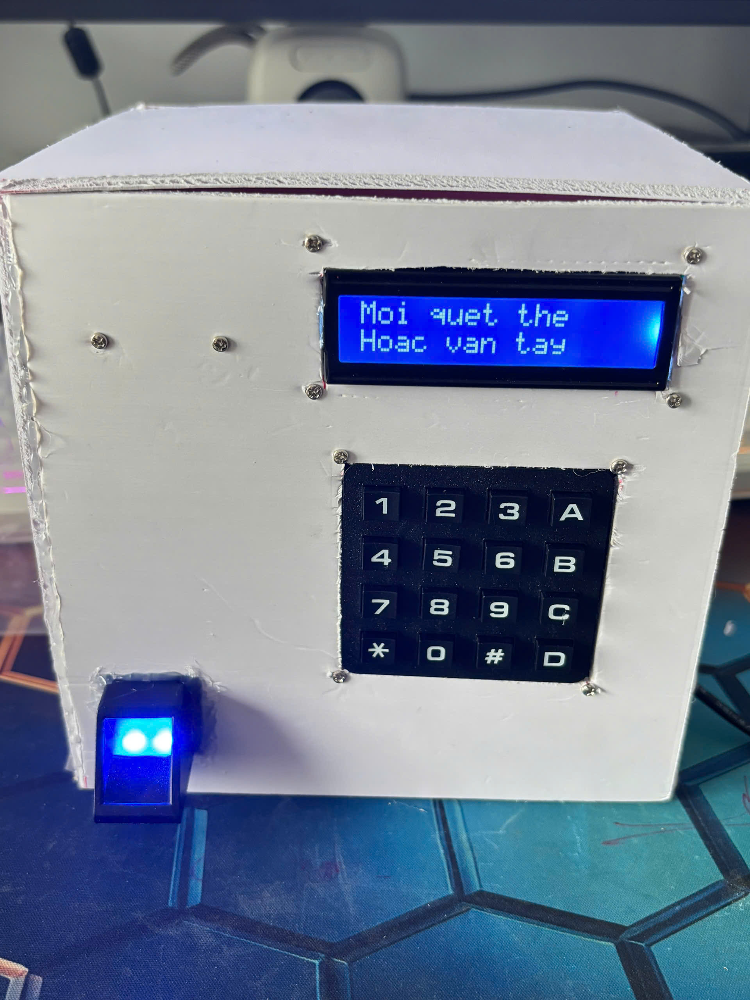

# He thong diem danh RFID va van tay dung ESP32

Do an xay dung he thong diem danh sinh vien su dung ESP32, RFID RC522, cam bien van tay AS608, Blynk va Google Sheets. He thong cho phep diem danh bang the RFID hoac van tay, quan ly buoi hoc, ghi nhan du lieu len Google Sheets va giam sat trang thai qua Blynk.



## Chuc nang chinh

- Diem danh sinh vien bang the RFID.
- Diem danh sinh vien bang cam bien van tay AS608.
- Them va xoa RFID cho tung ma so sinh vien.
- Them va xoa van tay cho tung ma so sinh vien.
- Quan ly dot hoc va buoi hoc.
- Mo buoi, dong buoi va mo buoi ke tiep.
- Ho tro cau hinh buoi hoc bu.
- Diem danh thu cong qua Blynk.
- Luu du lieu diem danh len Google Sheets thong qua Google Apps Script.
- Hien thi trang thai tren LCD I2C va Blynk.

## Cong nghe va phan cung

- ESP32.
- RFID RC522 va the RFID MIFARE.
- Cam bien van tay AS608.
- LCD I2C 16x2.
- Keypad 4x4 ket hop PCF8574.
- Buzzer va LED bao trang thai.
- Blynk IoT.
- Google Sheets va Google Apps Script.

## Cau truc thu muc

```text
firmware/
  Source_Code_v1/
    Source_Code_v1.ino      Ma nguon ESP32

apps-script/
  GoogleAppsScript.gs       Ma nguon Google Apps Script

data/
  MauLopHoc.xlsx            File mau danh sach lop

hardware/
  *.pdf                     So do mach in va tai lieu phan cung

images/
  *.jpg                     Anh mo hinh va demo he thong

README.md                   Mo ta du an va huong dan cau hinh
```

## Thu vien Arduino can cai

- WiFi
- WiFiClientSecure
- HTTPClient
- BlynkSimpleEsp32
- SPI
- MFRC522
- Wire
- LiquidCrystal_I2C
- Adafruit_Fingerprint
- ArduinoJson
- Preferences

## Cau hinh ESP32

Mo file:

```text
firmware/Source_Code_v1/Source_Code_v1.ino
```

Sau do thay cac gia tri mau bang thong tin that cua he thong:

```cpp
#define BLYNK_AUTH_TOKEN "YOUR_BLYNK_AUTH_TOKEN"

char ssid[] = "YOUR_WIFI_NAME";
char pass[] = "YOUR_WIFI_PASSWORD";
String GAS_URL = "YOUR_GOOGLE_APPS_SCRIPT_WEB_APP_URL";
```

Khong dua mat khau Wi-Fi, Blynk token hoac link Google Apps Script Web App that len GitHub public.

## Cau hinh Google Apps Script

1. Mo file Google Sheets dung de luu du lieu diem danh.
2. Chon `Extensions` > `Apps Script`.
3. Dan noi dung file `apps-script/GoogleAppsScript.gs` vao Apps Script Editor.
4. Luu lai du an.
5. Chon `Deploy` > `New deployment`.
6. Chon loai trien khai la `Web app`.
7. Thiet lap quyen truy cap phu hop voi ESP32.
8. Nhan `Deploy` va sao chep Web App URL.
9. Dan Web App URL vao bien `GAS_URL` trong file Arduino.

## Cau truc Google Sheets

He thong su dung cac sheet chinh:

- `SinhVien`: luu ma so sinh vien, ho ten, lop, UID RFID va ID van tay.
- `LichHoc`: luu thong tin dot hoc, buoi hoc, ngay hoc, gio hoc va trang thai buoi.
- `DotHoc1`: tong hop diem danh dot hoc 1.
- `DotHoc2`: tong hop diem danh dot hoc 2.
- `Log`: ghi nhan lich su diem danh.

## Ket noi phan cung chinh

```text
RC522:
SS   -> GPIO33
RST  -> GPIO4
SCK  -> GPIO18
MISO -> GPIO19
MOSI -> GPIO23

LCD I2C:
SDA -> GPIO21
SCL -> GPIO22

AS608:
TX AS608 -> GPIO34
RX AS608 -> GPIO32

Buzzer  -> GPIO17
LED do  -> GPIO27
LED xanh -> GPIO26
```

## Luu y khi van hanh

- Can cap nguon on dinh cho ESP32 va cac module ngoai vi.
- Khi dang ky van tay, nguoi dung can dat va nhac tay dung theo huong dan tren LCD.
- Neu Wi-Fi mat ket noi, he thong se thu ket noi lai truoc khi gui du lieu len Google Sheets.
- Khi dung repo public, can thay toan bo thong tin rieng bang placeholder truoc khi upload.
- He thong phu hop voi mo hinh do an va trinh dien; khi trien khai thuc te can bo sung bao mat du lieu va phan quyen truy cap.

## Tac gia

Do an 1 - Thiet ke he thong diem danh bang RFID va van tay  
SVTH: Nguyen Minh Nhat
